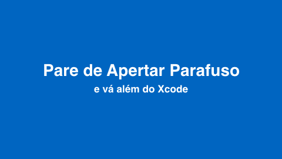

# Pare de Apertar Parafuso
### E vá além do Xcode

Conteúdo da talk Da Conferência NSBrazil, conferência dedicada à plataforma Apple, que aconteceu no Cubo do Itaú em São Paulo. Nessa palestra falei sobre como resolver problemas críticos e encontrar soluções que não necessitem do Xcode ou de qualquer outro ambiente onde se produz o código do app. O ganho de velocidade na resolução é imenso em boa parte dos casos e além de salvar horas ou dias de trabalho em investigação e debug, também pode melhorar a comunicação entre times multidisciplinares.

## Acesso rápido

### embrulha e manda
- [https://speakerdeck.com/dbonates/pare-de-apertar-parafuso](https://speakerdeck.com/dbonates/pare-de-apertar-parafuso)
- [https://bonates.com/nsbrazil19/nsbrazil19-alem-do-xcode](https://bonates.com/nsbrazil19/nsbrazil19-alem-do-xcode)

### sources no keynote (sem cortes, sem sensura por conta do tempo e incluindo outros formatos):
- [https://github.com/dbonates/nsbrazil-2019-alem-do-xcode](https://github.com/dbonates/nsbrazil-2019-alem-do-xcode)

### gif do bisect, demonstrando o fluxo de caça ao commit quebrado:
- [git-bisect-demo_compressed.gif](https://github.com/dbonates/nsbrazil-2019-alem-do-xcode/blob/master/videos/git-bisect-demo_compressed.gif)

### Contato, dúvidas etc
- @DanielBonates
- daniel@bonates.com
